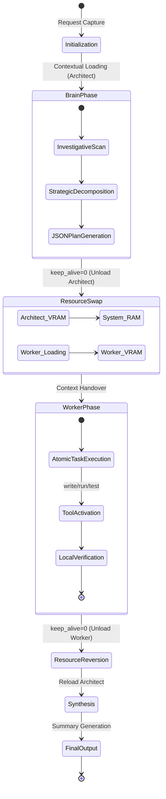

# SNAS CODE: Systemic Neural Agentic Solutions


## Overview

**SNAS CODE** is a state-of-the-art, multi-agent orchestration framework engineered for autonomous execution of complex software engineering cycles. Built on a foundation of **Heuristic Task Decomposition** and **Resource-Constraint Optimization**, SNAS CODE enables high-parameter local Large Language Models (LLMs) to operate seamlessly on consumer-grade hardware through a proprietary **Swap-to-Max** memory management protocol.

By decoupling high-level strategic reasoning from low-level implementation, SNAS CODE ensures that architectural integrity is maintained throughout the development lifecycle, regardless of the VRAM limitations of the host environment.

---

## System Architecture

The core of SNAS CODE is a dual-agent, asymmetric architecture designed for maximum efficiency and precision.



### 1. Heuristic Orchestrator (The "Brain")
The Orchestrator functions as the system's prefrontal cortex. It utilizes high-reasoning models (e.g., Gemma 2 9B, Llama 3.1 8B) to map natural language requirements into a discrete, actionable state-space.
- **Cognitive Domain**: Investigative research, dependency mapping, and multi-step strategy formulation.
- **Isolation Boundary**: Operates in a read-only sandboxed environment during the investigative phase to ensure system stability.

### 2. Specialist Implementation Unit (The "Worker")
The Worker is a high-throughput, specialized agent optimized for code generation and surgical file manipulation.
- **Execution Domain**: Direct workspace interaction, automated testing, and terminal-level command execution.
- **Verification Loop**: Implements a "Test-Before-Commit" protocol, ensuring all modifications are validated against the current system state.

---

## Core Innovations

### Swap-to-Max™ Memory Protocol
To circumvent the "VRAM Wall" common in local LLM deployments, SNAS CODE implements an aggressive model-swapping strategy:
- **Zero-Latency Unloading**: Explicitly forces Ollama to purge model weights from VRAM when transitioning between phases.
- **Context Preservation**: Strategic state serialization allows the system to reload the Architect with full awareness of the Worker's progress without memory overlap.

### Human-in-the-Loop (HITL) Authorization
SNAS CODE adheres to a **Zero-Trust Security Model**. Every destructive or state-altering operation (file writes, command execution) requires a signed cryptographic-like authorization from the user, preventing unintended side effects.

### Workspace State Verification
Post-execution, the system performs a recursive scan of the local filesystem to verify that the generated artifacts match the architectural plan, providing a secondary layer of objective truth.

---

## Technical Specifications

| Component | Technology | Role |
| :--- | :--- | :--- |
| **Orchestrator** | Ollama API / Python 3.10+ | Agentic Logic & Model Management |
| **Interface** | Rich (Console Protocol) | Real-Time Feedback & Stream Visualization |
| **Logic Layer** | Multi-Agent Directed Acyclic Graph (DAG) | Task Flow Control |
| **Memory Opt** | Swap-to-Max Protocol | VRAM Optimization |

---

## Deployment & Integration

### Prerequisites
- **Python**: 3.10 or higher.
- **Ollama**: Local instance with compatible models.
- **Hardware**: Minimum 16GB RAM (32GB recommended for large model swaps).

### Installation
```bash
git clone https://github.com/peeyush1278/SNAS-CODE.git
cd SNAS-CODE
pip install -r requirements.txt
```

### Initialization
```bash
python main.py
```

---

## Advanced Configuration
SNAS CODE features **Dynamic Capability Detection**. Upon startup, the system probes the local Ollama instance, heuristically ranking available models to automatically designate the most capable "Brain" and the most efficient "Worker."

---

*“Engineering the future of autonomous local development.”*
